# Configuração
## Fluxograma geral

```mermaid
flowchart LR
A([Início])
subgraph Região [<a href='#definição-das-regiões'>Região</a>]
B[<a href='#efetuar-a-criação-de-uma-vpc-e-um-subnet-para-cada-região-escolhida'>Criação da VPC</a>]
C[<a href='#efetuar-a-criação-de-uma-vpc-e-um-subnet-para-cada-região-escolhida'>Criação da Subnet</a>]
end
D[<a href='#efetuar-a-criação-de-uma-política-de-firewall-para-que-possa-ser-aplicada-as-vpcs'>Criação da política de firewall</a>]
subgraph Instâncias [<a href='#efetuar-criação-de-instâncias'>Instâncias</a>]
E[<a href='#efetuar-criação-de-instâncias'>Criação das instâncias</a>]
F[<a href='#efetuar-criação-de-instâncias'>Configuração das instâncias</a>]
end
G(((Fim)))
R[Escolha da Região]
A --> R -->|1 .. Quantidade de regiões| Região
B --> C
C --> B
C --> D
D --> Instâncias
E --> F
F --> E
F --> G

```

## Configuração do Google Cloud Platform
### Definição das regiões
| Região | Local |
|---|---|
| southamerica-east1 | São Paulo |
| us-west2 | Los Angeles |
| europe-west3 | Frankfurt |
| me-west1 | Tel Aviv |
| asia-east2 | Hong Kong |

### Efetuar a criação de uma VPC e um *subnet* para cada região escolhida.
1. Ir para o caminho:
    ```
    VPC network > VPC networks > Create new VPC network
    ```
2. Definir nome para a VPC.
3. Em `New subnet`:
    1. Definir o nome para a subrede.
    2. Selecionar a [região da subrede](#definição-das-regiões).
    3. Selecionar `IPv4 and IPv6 (dual-stack)` para ter a possibilidade de associar IPv4 e IPv6 às instâncias.
    4. Definir intervalo de endereços IPs que poderão ser associados para as instâncias
        - Obs: Por padrão, foi configurado o seguinte intervalo `10.0.1.0/24`
    5. Confirmar a criação da subrede.
- Obs: Regras de *firewall* podem ser configuradas nesse momento. No entanto, uma política será [criada posteriormente](#efetuar-a-criação-de-uma-política-de-firewall-para-que-possa-ser-aplicada-as-vpcs) para que possa ser aplicada a todas as VPCs criadas.
1. Confirme a criação da VPC

### Efetuar a criação de uma política de *firewall* para que possa ser aplicada as VPCs
- Para as portas padrões do SSH e Telnet, as portas 22/tcp e 23/tcp serão liberadas totalmente.
    - Para as portas de gerenciamento que serão utilizadas posteriormente para conexão, serão liberadas as portas 2222/tcp e 2223/tcp, para um IP específico.
        - Para liberar a conexão para sua máquina, verifique o endereço IP que ela está utlizando, em:
            ```
            https://meuip.com.br/
            ```
        - Esse IP será colocado no range de IP, para autorizar somente a sua conexão às instâncias dentro da VPC.
1. Ir para o caminho:
    ```
    VPC network > Firewall > Create firewall policy
    ```
2. Efetuar a configuração da política, atribuir regras e atribuir às VPCs
    1. `Configure policy`
        1. Definir nome para a política
        2. Avançar para próximo passo
    2. `Add rules (optional)`
        - Nessa seção, as regras de *firewall* serão criadas.
        - Observação: Por padrão, há regras de firewall aplicadas para saída de dados das instâncias para a *Internet*. Aqui serão configuradas as regras de entrada das VPCs.
        1. Clicar `Add rule`
            1. Definir prioridade da regra.
                - Quanto menor o valor, maior será a prioridade.
            2. Para IPv4:
                1. Em `Source`, defina o intervalo de endereços que terão permissão para conectar às instâncias.
                    1. Para permitir o acesso de toda a internet, defina o seguinte intervalo: `0.0.0.0/0`
                        1. Em `Protocols and ports`, selecione `Specified protocols and ports`
                            - Marque a opção `TCP`
                                - Insira os seguintes valores: `22,23`
                            - Marque a opção `Other`
                                - Insira o seguinte protocolo: `icmp`
                    2. Para permitir o seu acesso à VPC, insira seu IP
                        1. Em `Protocols and ports`, selecione `Specified protocols and ports`
                            - Marque a opção `TCP`
                                - Insira os seguintes valores: `2222,2223`
                    3. Finalize a criação da regra.
            3. Para IPv6:
                1. Em `Source`, defina o intervalo de endereços que terão permissão para conectar às instâncias.
                    1. Para permitir o acesso de toda a internet, defina o seguinte intervalo: `0::0/0`
                        1. Em `Protocols and ports`, selecione `Specified protocols and ports`
                            - Marque a opção `TCP`
                                - Insira os seguintes valores: `22,23`
                    2. Para permitir o seu acesso à VPC, insira seu IP
                        1. Em `Protocols and ports`, selecione `Specified protocols and ports`
                            - Marque a opção `TCP`
                                - Insira os seguintes valores: `2222,2223`
                    3. Finalize a criação da regra.
        2. Avançar para próximo passo
    3. `Associate policy with VPC networks (optional)`
        - Nessa seção, serão as regras de *firewall* criadas anteriormente serão atribuídas as VPCs.
        1. Clicar em `Associate`.
        2. Dentre as VPCs criadas, selecionar aquelas em que deseja-se atribuir as regras e avançar.
    4. Finalizar a criação da política de *firewall*.

### Efetuar criação de Instâncias
- Nessa seção, as instâncias serão criadas.
#### Configurações das instâncias
| SO | Versão SO | Boot Disk Type | Disk Size | Instance Type | vCPUs | RAM |
| --- | --- | --- | --- | --- | --- | --- |
| Ubuntu Server | Ubuntu 20.04 LTS x86/64 | Standard Persistent Disk | 10GB | e2.micro | 2 | 1GB |
1. Ir para o caminho:
   ```
    Compute Engine > VM Instances > Create instance
    ```
2. Definir nome para a instância.
   - Foi definido um padrão para o nome das instâncias, para facilitar a identificação das mesmas. O padrão é:
        ```
        localizacao-instance-x
        ```
        - A localização é referente à região onde a máquina está situada.
        - O valor x é referente ao tipo de acesso que a máquina terá, após a configuração do cowrie.
            | Nome | Método de acesso |
            |---|---|
            | instance-01 | Aleatório |
            | instance-02 | Passlist |
        - Exemplo: Para uma máquina situada na região `southamerica-east1`, com método de acesso aleatório, o nome da máquina será: `southamerica-east1-instance-01`.
        - Listagem das máquinas que serão criadas:
            | Nome | Região | Método de acesso |
            |---|---|---|
            | southamerica-east1-instance-01 | São Paulo | Aleatório |
            | southamerica-east1-instance-02 | São Paulo | Passlist |
            | us-west2-instance-01 | Los Angeles | Aleatório |
            | us-west2-instance-02 | Los Angeles | Passlist |
            | europe-west3-instance-01 | Frankfurt | Aleatório |
            | europe-west3-instance-02 | Frankfurt | Passlist |
            | me-west1-instance-01 | Tel Aviv | Aleatório |
            | me-west1-instance-02 | Tel Aviv | Passlist |
            | asia-east2-instance-01 | Hong Kong | Aleatório |
            | asia-east2-instance-02 | Hong Kong | Passlist |
3. Definir a região onde a [instância será colocada](#definição-das-zonas).
4. Em `Machine type`, selecionar o tipo da máquina que será utilizada (e2.micro).
5. Em `Boot disk`, clicar em `change`:
   1. Selecionar as [configurações definidas](#configurações-das-instâncias)
   2. Finalizar a configuração do disco.
6. Expandir a seção `Advanced options`:
    1. Em `Networking > Network interfaces`
       1. alterar a interface sugerida e selecionar a VPC criada para a região. 
       2. Em `Subnetwork`, selecionar a *subnet* associada à região.
       3. Em `IP stack type`, selecionar `IPv4 and IPv6 (dual-stack)`
       4. Finalizar a configuração da interface de rede.
    2. Em `Security`, expandir a seção `manage access`.
       1. Em `Add manually generated SSH keys`, clicar em `Add Item`
       2. Inserir a chave SSH.
7. Finalize a criação da instância.
   

## Instalação e configuração do *Cowrie* em instância já criada
1. Autorizar conexão SSH sem chave privada
    1. Criar usuário
        ```
        sudo adduser gabriel
        ```
    2. Fornecer permissões de `sudo`:
        ```
        sudo usermod -aG sudo gabriel
        ```
    3. Alterar permissão para conexão usando senha
        1. Acessar arquivo de configuração do SSH
            ```
            sudo nano /etc/ssh/sshd_config
            ```
        2. Trocar *flag* de autorização
            ```
            PasswordAuthentication no
            ```
            por
            ```
            PasswordAuthentication yes
            ```
        3. Reiniciar serviço para aplicar alterações
            ```
            sudo service ssh restart
            ```

2. Atualização das dependências do Ubuntu.
    ```
    sudo apt-get update
    ```

3. Instalação de dependências para cowrie.
    ```
    sudo apt-get install git python3-virtualenv libssl-dev libffi-dev build-essential libpython3-dev python3-minimal authbind virtualenv -y && sudo apt install python3.8-venv
    ```

4. Criação de usuário para cowrie.
    ```
    sudo adduser --disabled-password cowrie
    ```

5. Alternando para usuario cowrie.
    ```
    sudo su - cowrie
    ```

6. Clonagem de repositório cowrie.
    ```
    git clone http://github.com/cowrie/cowrie
    ```

7. Alternando para repositório clonado.
    ```
    cd cowrie
    ```

8. Criando ambiente virtual para execução do cowrie.
    ```
    python3 -m venv cowrie-env
    ```

9. Ativação de ambiente virtual.
    ```
    source cowrie-env/bin/activate
    ```

10. Instalação do pip e dependências do cowrie.
    ```
    python3 -m pip install --upgrade pip && python3 -m pip install --upgrade -r requirements.txt
    ```

11. Alteração de configurações para execução do cowrie.
    ```
    cd etc
    cp cowrie.cfg.dist cowrie.cfg
    nano cowrie.cfg
    ```
12. Alteração de parâmetros do cowrie
    1. Para máquinas com permissão de acesso aleatório:
        1. Descomentar linha que contém configuração `auth_class = AuthRandom`.
        2. Descomentar linha que contém configuração `auth_class_parameters`.
        3. Comentar linha com conteúdo `auth_class = UserDB`
        4. Definir valores para 2, 5, 10.
        5. A linha de configuração deverá ficar com o seguinte conteúdo: `auth_class_parameters = 2, 5, 10`.
    
    2. Para máquinas que usarão *passlist*:
        - Por padrão, o *cowrie* é configurado para usar um *passlist* para aceitar, ou não, as conexões. No caso, não será necessário nenhuma configuração adicional.
    
    3. Ativar `telnet`:
        1. Procurar por `[telnet]`.
        2. Trocar *flag* do *telnet*.
            1. Substituir linha com conteúdo `enabled = false` por `enabled = true`.

    4. Ativar suporte à IPv4 e IPv6
        1. SSH
            1. Localizar seção `[ssh]`.
            2. Adicionar parâmetro a seguir e comentar o atual, que contém `listen_endpoints`, na seção `[ssh]``.
                ```
                listen_endpoints = tcp6:2222:interface=\:\:
                ```        
        2. Telnet
            1. Localizar seção `[telnet]`.
            2. Adicionar parâmetro a seguir e comentar o atual, que contém `listen_endpoints`, na seção `[telnet]`.
                ```
                listen_endpoints = tcp6:2223:interface=\:\: tcp:2223:interface=0.0.0.0
                ```
    5. Salvar arquivo e fechar

13. Fazer redirecionamentos dos serviços (*SSH* e *Telnet*) entre as portas, usando `iptables` para IPv4 e `ip6tables` para IPv6.
    1. SSH
        1. Trocar porta *SSH* padrão de gerenciamento (22) para porta alta, por exemplo 2222.
            ```
            sudo iptables -t nat -A PREROUTING -p tcp --dport 22 -j REDIRECT --to-port 2222 && sudo ip6tables -t nat -A PREROUTING -p tcp --dport 22 -j REDIRECT --to-port 2222
            ```
        2. Trocar porta de execução do serviço do cowrie para a porta padrão (22)
            ```
            sudo iptables -t nat -A PREROUTING -p tcp --dport 2222 -j REDIRECT --to-port 22 && sudo ip6tables -t nat -A PREROUTING -p tcp --dport 2222 -j REDIRECT --to-port 22
            ```
        3. Verificar se regras foram aplicadas
            ```
            echo "iptables IPv4" && sudo iptables -t nat -v -L -n --line-number && echo -e '\n\nip6tables IPv6' && sudo ip6tables -t nat -v -L -n --line-number
            ```
        4. Se for necessário apagar alguma regra, use:
            ```
            sudo iptables -t nat -D PREROUTING 1
            ```
            Onde 1 é o número da regra que será excluída.
    2. Telnet
        1. Trocar porta *Telnet* padrão de gerenciamento (23) para porta alta, por exemplo 2223.
            ```
            sudo iptables -t nat -A PREROUTING -p tcp --dport 23 -j REDIRECT --to-port 2223 && sudo ip6tables -t nat -A PREROUTING -p tcp --dport 23 -j REDIRECT --to-port 2223
            ```
        2. Trocar porta de execução do serviço do cowrie para a porta padrão (23)
            ```
            sudo iptables -t nat -A PREROUTING -p tcp --dport 2223 -j REDIRECT --to-port 23 && sudo ip6tables -t nat -A PREROUTING -p tcp --dport 2223 -j REDIRECT --to-port 23
            ```
        3. Verificar se regras foram aplicadas
            ```
            echo "iptables IPv4" && sudo iptables -t nat -v -L -n --line-number && echo -e '\n\nip6tables IPv6' && sudo ip6tables -t nat -v -L -n --line-number
            ```
        4. Se for necessário apagar alguma regra, use:
            ```
            sudo iptables -t nat -D PREROUTING 1
            ```
            Onde 1 é o número da regra que será excluída.

14. Executar cowrie
    1. Voltar para diretório raiz do cowrie, via usuário `cowrie`
        ```
        cd ..
        ```
    2. Executar o cowrie
        ```
        bin/cowrie start
        ```
15. Verificar se está sendo executado
    ```
    sudo netstat -pln
    ```